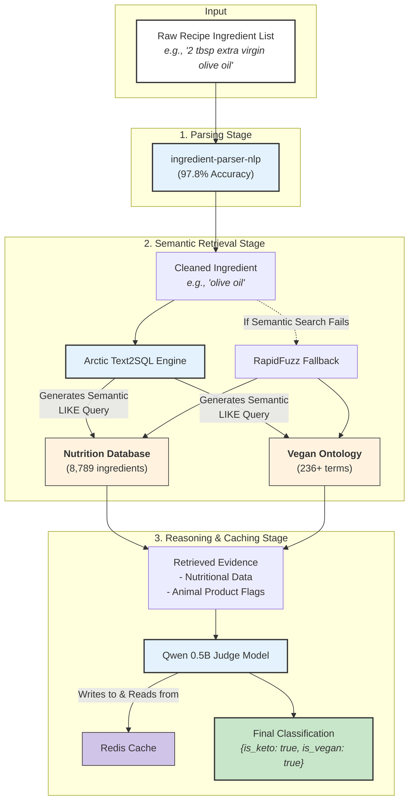

# Search By Ingredients -- Semantic Classification


[](https://python.org)
[](LICENSE)
[](https://ollama.ai/)

Classifies recipe ingredients as vegan and/or keto. Handles the messy real-world stuff: compound ingredients, hidden animal products (L-cysteine, gelatin, carmine), and regional synonyms. Runs locally. No cloud API required.

~0.6s per uncached ingredient. >90% cache hit rate in practice, so most ingredients resolve in <10ms.

---

## How It Works

Four stages in sequence:

1. **Parse** -- `ingredient-parser-nlp` extracts the core ingredient name from noisy recipe text (97.8% word-level accuracy). `"3 pounds pork shoulder, trimmed and cut into 2-inch chunks"` becomes `"pork shoulder"`.

2. **Retrieve** -- Arctic Text2SQL generates a semantic `LIKE` query against two databases. Prioritizes raw forms over processed variants to avoid contaminated nutritional data. Falls back to RapidFuzz if the semantic query returns nothing.

3. **Dual databases** -- Nutrition facts DB (8,789 ingredients) for keto analysis. Vegan ontology (236+ terms) for detecting hidden animal products that nutrition data misses.

4. **Judge** -- Qwen 0.5B weighs the retrieved evidence and outputs `is_vegan`, `is_keto`, and a plain-language reason.

135x faster than the previous brute-force API baseline (82s -> 0.6s per ingredient).

---

## Architecture



---

## Usage

```python
import asyncio
from ingredient_sense import Classifier

classifier = Classifier()

recipe_ingredients = [
    "3 pounds pork shoulder, cut into chunks",
    "2 tbsp extra virgin olive oil",
    "1 large onion, chopped",
    "4 cloves garlic, minced",
    "1 cup almond flour"
]

async def main():
    result = await classifier.classify_recipe(recipe_ingredients)
    print(f"Is Vegan: {result['is_vegan']}")
    print(f"Is Keto: {result['is_keto']}")
    print(f"Reasoning: {result['reasoning']}")

    for item in result['details']:
        print(f"{item['original']} -> {item['parsed']}: vegan={item['is_vegan']}, keto={item['is_keto']}")

asyncio.run(main())
```

Output:
```
Is Vegan: False
Is Keto: True
Reasoning: Not vegan -- contains pork shoulder. Keto-friendly -- all ingredients are low-carb.
```

---

## Performance

| Metric | Result |
|--------|--------|
| End-to-end latency (uncached) | ~0.6s / ingredient |
| End-to-end latency (cached) | <10ms / ingredient |
| Cache hit rate | >90% |
| Semantic match quality | 85%+ excellent/good |
| Data loading time | ~1.4s (Polars, 8,789 records) |

---

## Stack

Polars, Redis, Ollama (Arctic Text2SQL + Qwen 0.5B), ingredient-parser-nlp, RapidFuzz, MLflow, Numba, uv.

---

## Setup

**Prerequisites:** Python 3.11+, [Ollama](https://ollama.ai/), Redis running locally.

```bash
# Pull models
ollama pull snowflake/arctic-text2sql-artefact
ollama pull qwen:0.5b

# Install
git clone https://github.com/ShovalBenjer/argmax_solution.git
cd argmax_solution
python -m venv .venv && source .venv/bin/activate
pip install uv
uv pip sync requirements.txt

# Run
python main.py
```

---

## License

MIT.
