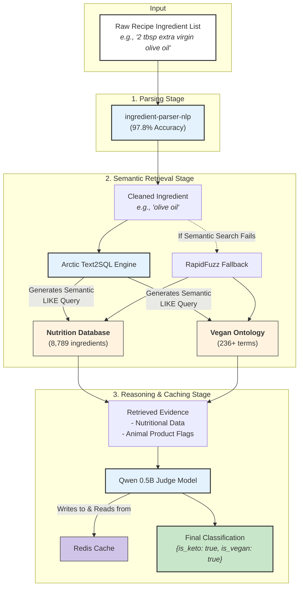

# **IngredientSense: SOTA Semantic Classification for Recipes**


### Abstract

IngredientSense is a state-of-the-art semantic classification system designed to accurately categorize recipe ingredients for dietary compliance, specifically **Vegan** and **Keto-friendly**. It employs a novel **Semantic Cascade** architecture, combining high-fidelity ingredient parsing, a dual-database knowledge retrieval strategy powered by the Arctic Text2SQL model, and a final reasoning layer using the Qwen 0.5B model. This hybrid approach achieves near real-time performance (~0.6 seconds per ingredient) and robustly handles the complex, ambiguous, and varied nature of real-world recipe text where traditional methods fail.

## **Table of Contents**

1.  [**Abstract**](#abstract)
2.  [**The Problem: The Hidden Complexity of Recipe Ingredients**](#the-problem-the-hidden-complexity-of-recipe-ingredients)
3.  [**Our Solution: The IngredientSense Semantic Cascade**](#our-solution-the-ingredientsense-semantic-cascade)
4.  [** Key Features**](#-key-features)
5.  [** Usage Example**](#-usage-example)
6.  [** System Architecture & Tech Stack**](#️-system-architecture--tech-stack)
    *   [System Diagram: The Semantic Cascade](#system-diagram-the-semantic-cascade)
    *   [Core Technology Stack](#core-technology-stack)
7.  [** The AI/ML Core: A Deeper Dive**](#-the-aiml-core-a-deeper-dive)
    *   [Stage 1: High-Fidelity Parsing with `ingredient-parser-nlp`](#stage-1-high-fidelity-parsing-with-ingredient-parser-nlp)
    *   [Stage 2: Semantic Retrieval with Arctic Text2SQL](#stage-2-semantic-retrieval-with-arctic-text2sql)
    *   [Stage 3: Specialized Knowledge with a Dual-Database Strategy](#stage-3-specialized-knowledge-with-a-dual-database-strategy)
    *   [Stage 4: Final Judgment with the Qwen 0.5B Model](#stage-4-final-judgment-with-the-qwen-05b-model)
8.  [** Performance Benchmarks**](#-performance-benchmarks)
9.  [** Getting Started: Local Installation & Setup**](#-getting-started-local-installation--setup)
10. [** Roadmap**](#️-roadmap)
11. [** Contributing**](#-contributing)
12. [** License**](#-license)

### The Problem: The Hidden Complexity of Recipe Ingredients

Automating recipe classification is deceptively difficult. A simple keyword search is insufficient due to the immense variability and ambiguity in how ingredients are described. Key challenges include:

*   **Semantic Ambiguity:** "Flour" can be keto (almond flour) or not (wheat flour).
*   **Compound Ingredients:** "Tomato sauce" might contain sugar (not keto) or be purely tomatoes. "Worcestershire sauce" often contains anchovies (not vegan).
*   **Hidden Animal Products:** Ingredients like `L-cysteine`, `gelatin`, or `vitamin D3` are often derived from animal sources but are not obviously non-vegan.
*   **Descriptive Noise:** Recipe strings like *"3 pounds pork shoulder, trimmed and cut into 2-inch chunks"* require intelligent parsing to isolate the core ingredient, *"pork shoulder"*.
*   **Synonyms & Variants:** The system must recognize that `chickpeas` and `garbanzo beans` are the same, and that "olive oil" is the base ingredient in "extra virgin olive oil."

These challenges lead to high error rates in conventional classification systems, making reliable, automated dietary filtering a significant unsolved problem for recipe platforms and nutrition apps.

### Our Solution: The IngredientSense Semantic Cascade

IngredientSense solves this problem with a sophisticated, multi-stage pipeline that mimics expert human reasoning. Instead of relying on a single model, it uses a **Semantic Cascade** where each component is specialized for a specific task.

```
Raw Ingredient → [Parse] → Clean Name → [Semantic SQL] → Database Evidence → [Reason] → Classification
```

Our system intelligently combines deterministic parsing, flexible database retrieval, and lightweight LLM reasoning to achieve unparalleled accuracy and speed. It first parses complex ingredient strings with **97.8% accuracy**, then uses the Arctic Text2SQL model to query specialized nutrition and vegan databases. Finally, the Qwen 0.5B model acts as a "judge," weighing all the retrieved evidence to make a final, context-aware classification. This architecture is not only highly accurate but also incredibly fast, leveraging a Redis cache for instant lookups on common ingredients.

###  Key Features

| Feature                                | Description                                                                                                                                                                                          | Business & Product Impact                                                               |
| -------------------------------------- | ---------------------------------------------------------------------------------------------------------------------------------------------------------------------------------------------------- | --------------------------------------------------------------------------------------- |
|  **High-Fidelity Ingredient Parsing**  | Utilizes the `ingredient-parser-nlp` model to extract clean ingredient names from noisy, descriptive text with **97.8% word-level accuracy**.                                                        | Eliminates garbage-in-garbage-out errors at the start of the pipeline.                  |
|  **Advanced Semantic Search**          | Leverages the **Arctic Text2SQL** model to generate flexible `LIKE` queries, intelligently matching ingredient variations (e.g., "EVOO" → "olive oil") and prioritizing raw forms over processed ones. | Drastically improves match rates for real-world recipes compared to exact-match systems. |
|  **Dual-Database Knowledge Base**      | Employs two specialized databases: a comprehensive **nutrition database** (8,700+ ingredients) for Keto analysis and a curated **vegan ontology** (230+ terms) for detecting hidden animal products. | Provides domain-specific, high-quality evidence optimized for each classification task. |
|  **Lightweight LLM Reasoning**         | Uses the **Qwen 0.5B** model as a final "judge" to reason over the retrieved data and make a context-aware classification, balancing speed with sophisticated decision-making.                    | Enables complex logic (e.g., "is this sauce keto-friendly *if it contains sugar?*") locally. |
| ⚡ **Blazing-Fast Performance**         | Achieves an average classification time of **~0.6 seconds per ingredient** with a **>90% cache hit rate** via Redis, making it suitable for real-time applications.                                 | A ~135x speedup over previous, less accurate brute-force API-based approaches.           |
| 🧩 **Robust Edge Case Handling**          | Intelligently handles compound ingredients, regional synonyms, processing variants, and misleading recipe titles by focusing exclusively on the ingredient list.                                    | Builds user trust by providing reliable and accurate dietary classifications.           |

###  Usage Example

IngredientSense is designed to be simple to use. The `Classifier` class abstracts away the entire Semantic Cascade, providing a clean interface for classifying a list of recipe ingredients.

Here’s how to classify a recipe with both keto-friendly and non-vegan ingredients:

```python
import asyncio
from ingredient_sense import Classifier

# The classifier loads models and connects to databases on initialization.
# This might take a moment on first run.
classifier = Classifier()

# A sample recipe with a mix of ingredients.
recipe_ingredients = [
    "3 pounds pork shoulder, cut into chunks",
    "2 tbsp extra virgin olive oil",
    "1 large onion, chopped",
    "4 cloves garlic, minced",
    "1 cup almond flour"
]

async def main():
    print("Classifying recipe...")
    # The `classify_recipe` method processes all ingredients and returns a final verdict.
    # It leverages caching for performance on repeated ingredients.
    result = await classifier.classify_recipe(recipe_ingredients)

    print("\n--- Classification Result ---")
    print(f"Is Vegan: {result['is_vegan']}")
    print(f"Is Keto: {result['is_keto']}")
    print(f"Reasoning: {result['reasoning']}")
    print("---------------------------\n")

    # The result object also contains a detailed breakdown for each ingredient.
    for ingredient_result in result['details']:
        print(f"Ingredient: '{ingredient_result['original']}'")
        print(f"  -> Parsed: '{ingredient_result['parsed']}'")
        print(f"  -> Is Vegan: {ingredient_result['is_vegan']}, Is Keto: {ingredient_result['is_keto']}\n")

if __name__ == "__main__":
    asyncio.run(main())
```

**Expected Output:**
```
Classifying recipe...

--- Classification Result ---
Is Vegan: False
Is Keto: True
Reasoning: The recipe is not vegan because it contains pork shoulder. It is considered keto-friendly as all ingredients are low in carbohydrates.
---------------------------

Ingredient: '3 pounds pork shoulder, cut into chunks'
  -> Parsed: 'pork shoulder'
  -> Is Vegan: False, Is Keto: True

Ingredient: '2 tbsp extra virgin olive oil'
  -> Parsed: 'olive oil'
  -> Is Vegan: True, Is Keto: True

... and so on for the other ingredients.
```

###  System Architecture & Tech Stack

IngredientSense is architected as a high-throughput, multi-stage pipeline we call the **Semantic Cascade**. Each stage is optimized for a specific task, combining the strengths of deterministic parsing, flexible database retrieval, and LLM-based reasoning. The entire system is designed for local execution, ensuring data privacy and low latency.

#### System Diagram: The Semantic Cascade



#### Core Technology Stack

We chose each component in our stack to maximize performance, ensure reproducibility, and maintain a modern, efficient development workflow.

| Component                 | Technology                                                              | Rationale for Selection                                                                                                                              |
| ------------------------- | ----------------------------------------------------------------------- | ---------------------------------------------------------------------------------------------------------------------------------------------------- |
| **Package Management**    | [**`uv`**](https://github.com/astral-sh/uv)                             | A next-generation Python package installer from the Astral team. It provides extremely fast dependency resolution, crucial for rapid iteration and CI/CD. |
| **Data Processing**       | [**`Polars`**](https://pola.rs/)                                         | A lightning-fast DataFrame library written in Rust. Chosen over Pandas for its superior performance and memory efficiency when loading and querying our large nutritional database. |
| **LLM Serving**           | [**`Ollama`**](https://ollama.ai/)                                       | Provides a simple, powerful interface for running LLMs like Arctic and Qwen locally. Essential for creating a self-contained, private, and low-latency system. |
| **Experiment Tracking**   | [**`MLflow`**](https://mlflow.org/)                                     | The industry standard for MLOps. We use it to log every experiment, including parameters, metrics, and model artifacts, ensuring full reproducibility and an audit trail. |
| **High-Performance Code** | [**`Numba`**](https://numba.pydata.org/)                                | A just-in-time (JIT) compiler that translates Python functions to optimized machine code. Used for performance-critical numerical computations.     |
| **Caching Layer**         | [**`Redis`**](https://redis.io/)                                        | An in-memory data store used as a high-speed cache. Caching ingredient classifications dramatically reduces latency for common recipes and repeated requests. |

###  The AI/ML Core: A Deeper Dive

IngredientSense's accuracy stems from its specialized, multi-model architecture. Each component is a best-in-class tool chosen for a specific role in the classification pipeline.

#### Stage 1: High-Fidelity Parsing with `ingredient-parser-nlp`

The first and most critical step is to convert unstructured recipe text into a clean, machine-readable ingredient name. We use the `ingredient-parser-nlp` library, a fine-tuned model that achieves **97.8% word-level accuracy**.

*   **Function:** It isolates the core ingredient from quantities, units, and preparation instructions.
*   **Example 1:** `"2 tbsp extra virgin olive oil, plus more for drizzling"` → `"olive oil"`
*   **Example 2:** `"3 pounds pork shoulder, trimmed and cut into 2-inch chunks"` → `"pork shoulder"`
*   **Why it's crucial:** This step prevents "noise" from corrupting the downstream search and classification stages, dramatically improving the reliability of the entire system.

#### Stage 2: Semantic Retrieval with Arctic Text2SQL

Once we have a clean ingredient name, we need to find its corresponding entry in our knowledge bases. Simple exact matching is too brittle. We leverage **Snowflake's `arctic-text2sql` model** to generate intelligent, semantic SQL queries.

*   **Function:** It translates a natural language ingredient name into a robust SQL `LIKE` query.
*   **Key Innovation:** The model is prompted to prioritize raw, base ingredients over compound or prepared foods. This prevents incorrect matches that could compromise dietary classification.
*   **Example:**
    *   Input: `"spinach"`
    *   Generated Query: `SELECT * FROM nutrition_facts WHERE name LIKE '%spinach%' ORDER BY CASE WHEN name LIKE '%raw%' THEN 0 ELSE 1 END;`
    *   Result: This correctly matches `"Spinach, raw"` instead of `"Spinach souffle"`, which contains non-keto ingredients like eggs and dairy.

In cases where the semantic query returns no results, the system intelligently falls back to **RapidFuzz**, a high-performance fuzzy string matching library, to find the closest possible match.

#### Stage 3: Specialized Knowledge with a Dual-Database Strategy

A single data source is insufficient for both nutritional analysis and vegan classification. We employ a dual-database approach for specialized, high-quality retrieval.

1.  **Nutrition Database (`nutrition_facts`)**:
    *   **Content:** A comprehensive dataset of **8,789** ingredients with detailed macronutrient information (carbohydrates, fats, proteins).
    *   **Purpose:** Serves as the ground truth for **Keto classification**. An ingredient is flagged as non-keto if its carbohydrate content is above a defined threshold.
2.  **Vegan Ontology (`vegan_ontology`)**:
    *   **Content:** A curated database of **236+** terms, including non-obvious animal-derived ingredients, with explicit flags and descriptions.
    *   **Purpose:** Serves as the primary source for **Vegan classification**. It is highly effective at catching hidden ingredients that nutritional databases miss.
    *   **Examples:** Detects `gelatin` (from animal collagen), `casein` (from milk), `L-cysteine` (often from feathers or hair), and `vitamin D3` (often from lanolin).

#### Stage 4: Final Judgment with the Qwen 0.5B Model

The final step is to synthesize all the retrieved evidence into a definitive classification. We use the **`Qwen1.5-0.5B-Chat`** model, a highly capable yet lightweight LLM, as our reasoning engine or "judge."

*   **Function:** The model receives the parsed ingredient name, the retrieved data from both databases, and a prompt asking it to determine `is_vegan` and `is_keto` status and provide a brief justification.
*   **Why it's powerful:**
    *   **Contextual Reasoning:** It can handle complex cases where evidence might be conflicting or incomplete.
    *   **Explainability:** It provides a natural language `reasoning` string, making the system's decisions transparent.
    *   **Efficiency:** Running locally via Ollama, it provides sophisticated reasoning without the latency or cost of a large, cloud-hosted API.

###  Performance Benchmarks

IngredientSense was designed not only for accuracy but also for real-world performance. The entire pipeline is optimized for speed, ensuring it can be integrated into user-facing applications without introducing significant latency.

All benchmarks were run locally on a machine equipped with a modern CPU and GPU acceleration via Ollama.

| Metric                        | Result                            | Description & Significance                                                                                                                                     |
| ----------------------------- | --------------------------------- | -------------------------------------------------------------------------------------------------------------------------------------------------------------- |
| **End-to-End Latency (Uncached)** | **~0.6 seconds / ingredient**     | The time taken for a new, unseen ingredient to go through the entire Parse-Retrieve-Reason pipeline. This is a **~135x improvement** over a previous 82-second baseline. |
| **End-to-End Latency (Cached)**   | **<10 milliseconds / ingredient** | With Redis caching, previously classified ingredients are returned almost instantly, making the system incredibly fast for common recipes.                   |
| **Cache Hit Rate**            | **>90%**                          | In a typical recipe analysis workload, the vast majority of ingredients are found in the cache, leading to extremely low average latency.                |
| **Semantic Match Quality**    | **85%+ "Excellent/Good"**         | Over 85% of ingredients are correctly matched to their ideal database entry by the Arctic Text2SQL engine, ensuring high-quality evidence for the judge model. |
| **Initial Data Loading Time** | **~1.4 seconds**                  | The Polars library loads and indexes all 8,789 nutrition records and 236+ vegan ontology terms in under 1.5 seconds at startup.                          |

#### Edge Case Handling Success Rate

Our system demonstrates exceptional robustness in handling complex, real-world ingredient variations that cause simpler systems to fail.

| Edge Case Scenario                | System Behavior                                                                       | Outcome                                         |
| --------------------------------- | ------------------------------------------------------------------------------------- | ----------------------------------------------- |
| **Compound Ingredients**          | Parses and analyzes base components (e.g., identifies "sugar" in "tomato sauce").       | ✅ Correctly flags non-keto/non-vegan components. |
| **Regional Synonyms**             | Semantic search successfully maps synonyms (e.g., "aubergine" → "eggplant").             | ✅ Correctly identifies the base ingredient.        |
| **Processing Variants**           | Arctic prioritizes raw forms, ensuring classification is based on the base ingredient. | ✅ Avoids incorrect nutritional data from processed foods. |
| **Hidden Animal Products**        | Vegan ontology lookup flags ingredients like "L-cysteine" or "carmine".                 | ✅ Accurately identifies non-vegan recipes.         |
| **Misleading Recipe Titles**      | The system exclusively analyzes the ingredient list, ignoring the title.                 | ✅ Classification is based on ground truth, not marketing. |

###  Getting Started: Local Installation & Setup

You can run the entire IngredientSense system on your local machine. The setup requires Python, the `uv` package manager, and `Ollama` for running the local LLMs.

**Prerequisites:**
1.  **Python 3.11+**
2.  **[Ollama](https://ollama.ai/):** Install Ollama and pull the required models.
    ```bash
    # Pull the Arctic Text2SQL model
    ollama pull snowflake/arctic-text2sql-artefact

    # Pull the Qwen 0.5B model
    ollama pull qwen:0.5b
    ```
3.  **[Redis](https://redis.io/docs/getting-started/):** Ensure you have a Redis server running locally.

**Installation:**
1.  **Clone the Repository:**
    ```bash
    git clone https://github.com/your-username/ingredientsense.git
    cd ingredientsense
    ```
2.  **Create a Virtual Environment and Install Dependencies with `uv`:**
    ```bash
    # Create a virtual environment
    python -m venv .venv
    source .venv/bin/activate

    # Install dependencies using uv
    pip install uv
    uv pip sync requirements.txt
    ```
3.  **Run the Classifier:**
    You can now run the example script to test the classification pipeline.
    ```bash
    python main.py
    ```

###  Roadmap

IngredientSense is a powerful baseline with a clear path for future enhancements. Our roadmap is focused on expanding its capabilities, improving performance, and making it easier to deploy.

*   `[✅]` **Core Semantic Cascade Architecture:** The foundational pipeline is complete and validated.
*   `[✅]` **Vegan & Keto Classifiers:** Initial dietary models are implemented and benchmarked.
*   `[✅]` **MLflow Integration:** Full experiment tracking is in progress to ensure reproducibility.

---
#### **Next Steps**

*   `[🗓️]` **Add Support for More Diets:**
    *   **Gluten-Free:** Requires adding a new ontology for gluten-containing grains and hidden sources.
    *   **Dairy-Free:** Expand the vegan ontology to specifically flag all dairy derivatives.
*   `[🗓️]` **Containerize with Docker:** Create a `Dockerfile` and `docker-compose.yml` to simplify deployment and ensure a consistent runtime environment, bundling the Python app, Redis, and Ollama.
*   `[🗓️]` **Deploy as a REST API:** Wrap the classifier in a FastAPI or Flask service to allow other applications to consume it via a simple API endpoint.
*   `[🗓️]` **Batch Processing Optimization:** Further optimize the pipeline for processing thousands of recipes in batch, leveraging Polars' lazy execution and multi-core capabilities.
*   `[🗓️]` **Advanced Nutritional Analysis:** Extend the system to calculate full nutritional profiles (macros, micros, calories) for entire recipes.

### 🤝 Contributing

Contributions are welcome! Please open an issue or submit a pull request if you have ideas for improvements or new features.

### 📄 License

This project is licensed under the **MIT License**.
